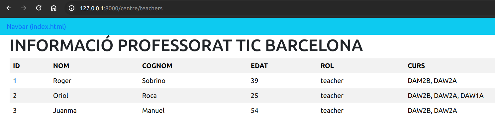
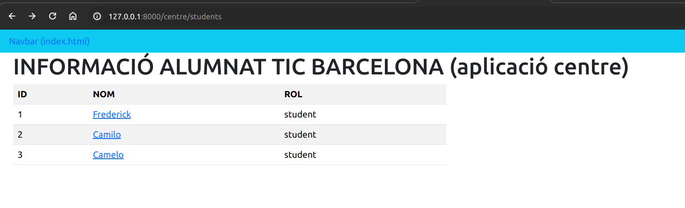

# DJANGO

## PRÀCTICA 1 - VIEWS I TEMPLATES

1. Crear un projecte de DJANGO de nom TIC_GestioPersonal.
El nom de l’aplicació a on s’hi afegiran els templates i les views és centre.
Es farà una aplicació per mostrar dades de l’alumnat de DAW2B i del seu professorat.
Dades a mostrar alumnat: nom, cognom1, cognom2, correu, curs, mòduls matriculats.
Dades a mostrar prof.: nom, cognom1, cognom2, correu, curs, tutor(si s’escau),mòduls que imparteix.

   - Path alumne: localhost:8000/centre/students
   - Path professor: localhost:8000/centre/teachers

    Només la pàgina principal (del projecte) ha de renderitzar també un header. Aquest header sempre es mostrarà (independentment de si està mostrant dades de professorat o d’alumnat).

**Pàgina de centre/teachers:**

**Pàgina de centre/students:**
